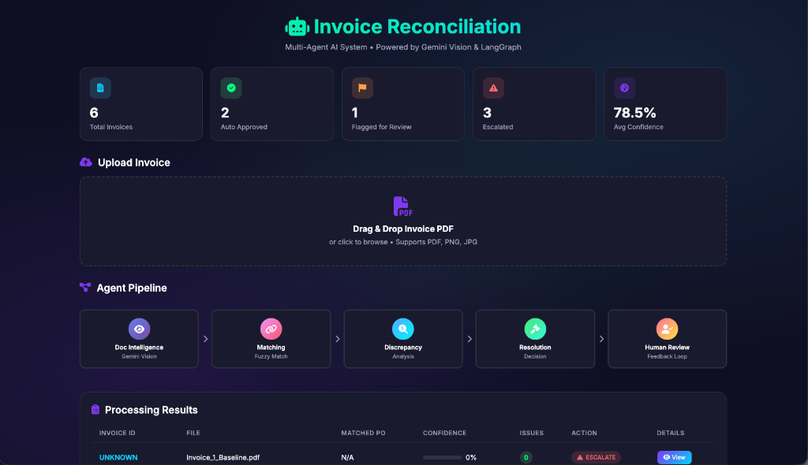
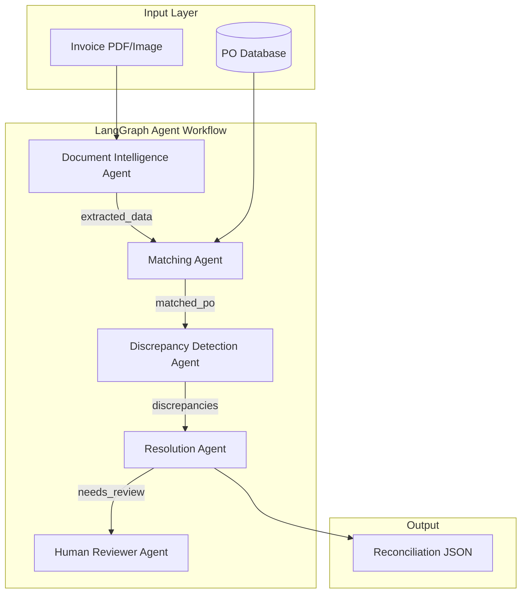

# 🧾 Multi-Agent Invoice Reconciliation System

[](https://www.python.org/downloads/)
[](https://langchain-ai.github.io/langgraph/)
[](https://opensource.org/licenses/MIT)



A production-grade multi-agent system that processes supplier invoices, extracts structured data using AI, matches against purchase orders with fuzzy logic, and intelligently flags discrepancies with confidence scoring.

## 🏗️ Architecture



## ✨ Features

- **🤖 4 Core Agents + 1 Bonus Agent**
  - Document Intelligence (Gemini Vision for OCR/extraction)
  - Matching Agent (3-tier fuzzy matching)
  - Discrepancy Detection (price/quantity variance checks)
  - Resolution Agent (intelligent recommendations)
  - **BONUS**: Human Reviewer Agent (feedback loop simulation)

- **🎯 Intelligent Matching**
  - Tier 1: Exact PO reference match (95%+ confidence)
  - Tier 2: Supplier + Products fuzzy match (70-85%)
  - Tier 3: Products-only fuzzy match (50-70%)

- **📊 Confidence Scoring Throughout**
  - Per-field extraction confidence
  - Match confidence scoring
  - Risk-based decision making

## 🚀 Quick Start

### Prerequisites

- Python 3.9+
- Google API Key (for Gemini)
- Tesseract OCR (optional, for fallback)

### Installation

```bash
# Clone the repository
git clone https://github.com/yourusername/multi-agent-invoice-reconciliation-system.git
cd multi-agent-invoice-reconciliation-system

# Create virtual environment
python3 -m venv venv
source venv/bin/activate  # On Windows: venv\Scripts\activate

# Install dependencies
pip install -r requirements.txt

# Set up environment variables
cp .env.example .env
# Edit .env and add your GOOGLE_API_KEY
```

### Running the System

```bash
# Process all 5 test invoices
python src/main.py --process-all

# Process a single invoice
python src/main.py --invoice providedfiles/Invoice_1_Baseline.pdf

# Demo mode with extra visualization
python src/main.py --demo
```

## 📁 Project Structure

```
multi-agent-invoice-reconciliation-system/
├── src/
│   ├── agents/
│   │   ├── document_intelligence.py   # Gemini Vision extraction
│   │   ├── matching_agent.py          # 3-tier fuzzy matching
│   │   ├── discrepancy_detection.py   # Price/qty variance checks
│   │   ├── resolution_agent.py        # Decision recommendations
│   │   └── human_reviewer.py          # BONUS: Feedback loop
│   ├── core/
│   │   ├── config.py                  # Settings & thresholds
│   │   ├── state.py                   # LangGraph state
│   │   └── workflow.py                # Agent orchestration
│   ├── models/
│   │   └── schemas.py                 # Pydantic models
│   ├── utils/
│   │   └── po_database.py             # PO fuzzy search
│   └── main.py                        # CLI entry point
├── providedfiles/                     # Test invoices & PO database
├── outputs/                           # Processing results
├── requirements.txt
└── README.md
```

## 🧪 Test Invoices

| Invoice   | Challenge                | Expected Result              |
| --------- | ------------------------ | ---------------------------- |
| Invoice 1 | Clean PDF, baseline      | ✅ Auto-approve               |
| Invoice 2 | Scanned/rotated          | ✅ Extract with OCR           |
| Invoice 3 | Different format         | ✅ Match with fuzzy logic     |
| Invoice 4 | **10% price increase**   | ⚠️ Flag Ibuprofen £88 vs £80  |
| Invoice 5 | **Missing PO reference** | ⚠️ Fuzzy match to PO-2024-005 |

## 📋 Output Format

```json
{
  "invoice_id": "INV-2024-1001",
  "processing_results": {
    "extraction_confidence": 0.95,
    "document_quality": "excellent",
    "extracted_data": { ... },
    "matching_results": {
      "matched_po": "PO-2024-001",
      "po_match_confidence": 0.98,
      "match_method": "exact_po_reference"
    },
    "discrepancies": [],
    "recommended_action": "auto_approve",
    "agent_reasoning": "Clean extraction, exact PO match, no discrepancies..."
  },
  "agent_execution_trace": { ... }
}
```

## 🔧 Configuration

Key thresholds in `src/core/config.py`:

| Parameter                     | Value | Description                     |
| ----------------------------- | ----- | ------------------------------- |
| Price variance (auto-approve) | ±2%   | Prices within this range are OK |
| Price variance (flag)         | 5-15% | Requires human review           |
| Price variance (escalate)     | >15%  | Immediate escalation            |
| Confidence (auto-approve)     | ≥90%  | High confidence threshold       |
| Fuzzy match threshold         | ≥70%  | Minimum for supplier matching   |

## 🤝 Agent Communication

Agents communicate through a shared state object, not simple linear pipelines:

1. **Document Intelligence** → Extracts data, sets confidence
2. **Matching Agent** → Finds PO, calculates match score
3. **Discrepancy Detection** → Identifies variances
4. **Resolution Agent** → Evaluates all findings, recommends action
5. **Human Reviewer** (if needed) → Simulates feedback loop

## 📝 Analysis

See [ANALYSIS.md](./ANALYSIS.md) for the 500-word written analysis covering:
- Where OCR/extraction fails and how agents compensate
- Path from 70% to 95% accuracy
- Validation at 10,000 invoices/day scale

## 🎥 Demo Video

[Demo video](https://youtu.be/g_SrE6VLMvk) - Shows:
- Processing all 5 invoices
- Agent decision-making and reasoning chains
- Critical test detection (Invoice 4 & 5)
- Honest discussion of limitations

## 📜 License

MIT License - see LICENSE file for details.

---

Built for the NIYAMRAI Agent Development Internship Assessment
