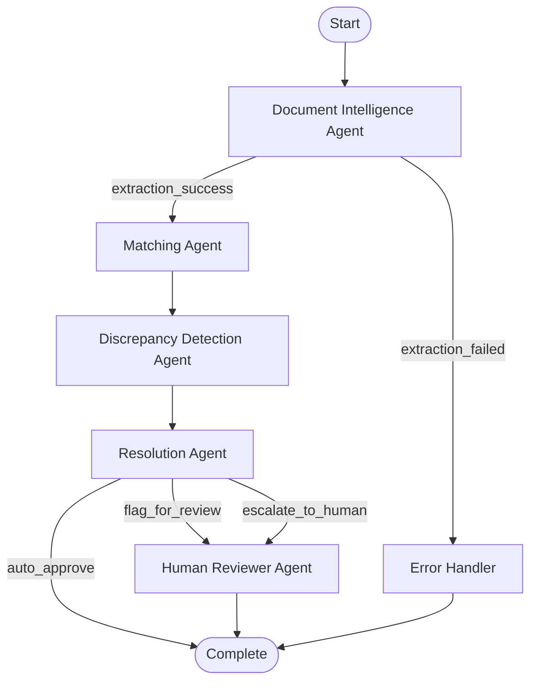

# System Architecture

## Multi-Agent Workflow

This system uses LangGraph for intelligent agent orchestration. Unlike simple linear pipelines, agents make conditional decisions about routing:



## Agent Responsibilities

### 1. Document Intelligence Agent
- **Input**: Invoice PDF/image path
- **Output**: Extracted structured data + confidence scores
- **Technology**: Gemini 1.5 Flash Vision API
- **Key Features**:
  - Direct PDF understanding (no preprocessing needed)
  - Per-field confidence scoring
  - Document quality assessment

### 2. Matching Agent
- **Input**: Extracted invoice data
- **Output**: Matched PO + match confidence
- **Technology**: RapidFuzz for fuzzy matching
- **Key Features**:
  - 3-tier matching strategy
  - Alternative match suggestions
  - Handles missing PO references

### 3. Discrepancy Detection Agent
- **Input**: Invoice data + matched PO
- **Output**: List of discrepancies with severity
- **Key Features**:
  - Price variance detection (catches Invoice 4)
  - Quantity mismatch detection
  - Total variance calculation
  - Severity classification

### 4. Resolution Agent
- **Input**: All previous agent outputs
- **Output**: Recommended action + reasoning
- **Key Features**:
  - Multi-factor decision making
  - Risk assessment
  - Comprehensive reasoning generation

### 5. Human Reviewer Agent (BONUS)
- **Input**: Flagged/escalated invoices
- **Output**: Simulated review feedback
- **Key Features**:
  - Demonstrates feedback loop pattern
  - Correction suggestions
  - Re-processing trigger capability

## State Management

Agents communicate through a shared TypedDict state:

```python
class AgentState(TypedDict):
    invoice_path: str
    extracted_data: Optional[ExtractedInvoice]
    extraction_confidence: float
    matching_results: Optional[MatchingResult]
    discrepancies: List[Discrepancy]
    recommended_action: str
    agent_traces: dict
    ...
```

## Confidence Scoring

Every decision includes confidence:

| Threshold | Action                |
| --------- | --------------------- |
| ≥90%      | Auto-approve eligible |
| 70-89%    | Flag for review       |
| <70%      | Escalate to human     |

## Error Handling

- Try/catch in each agent
- Graceful degradation (partial results)
- Error state propagates to Resolution Agent
- Always outputs valid JSON even on failure
